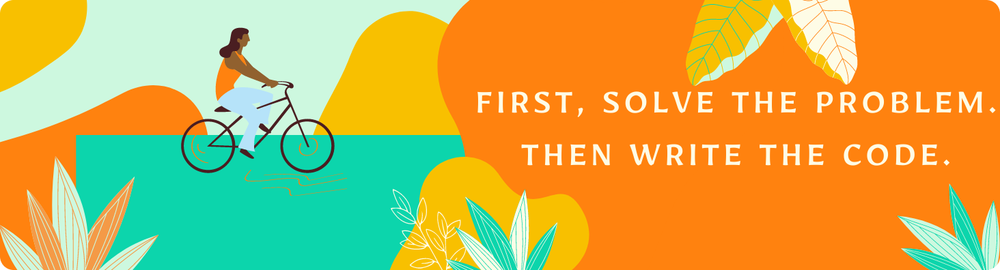

 

# Hi there ! 👋 I'm Musa

- 🌱 I’m currently trainee Web Developer at 
- 〽️ My motto in life is "Never stop learning because life never stops teaching!!!"
- ❤️ I love everything that can fly  🚀 🦅 ✈️ 🦋 

### Connect with me:

[][linkedin]

 
 

### Languages and Tools:

 
 

---

|  |  |
| --------------------------------------------------------------------------------------------------------------------------------------------------------------------------------------------------------------------------------------------------------------------- | --------------------------------------------------------------------------------------------------------------------------------------------------------------------------------------------- |

[linkedin]: https://www.linkedin.com/in/musa-yuksel-625838205/
[html]: "/"
[css]: "/"
[js]: "/"
[react]: "/"
[nodejs]: "/"
[sql]: "/"
[git]: "/"
[cli]: "/"
